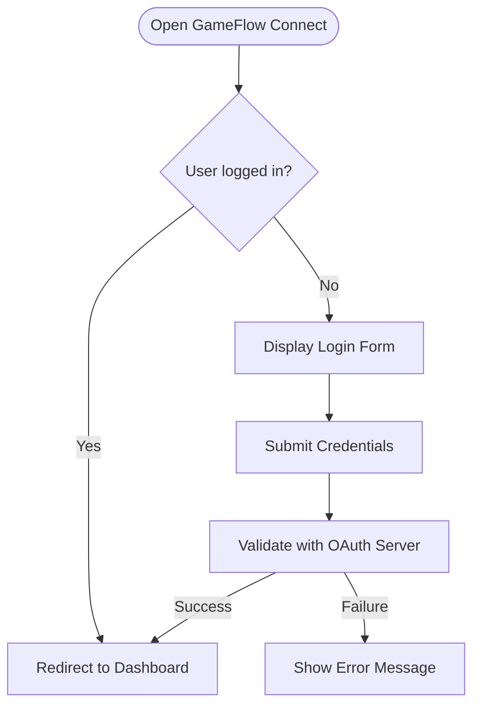
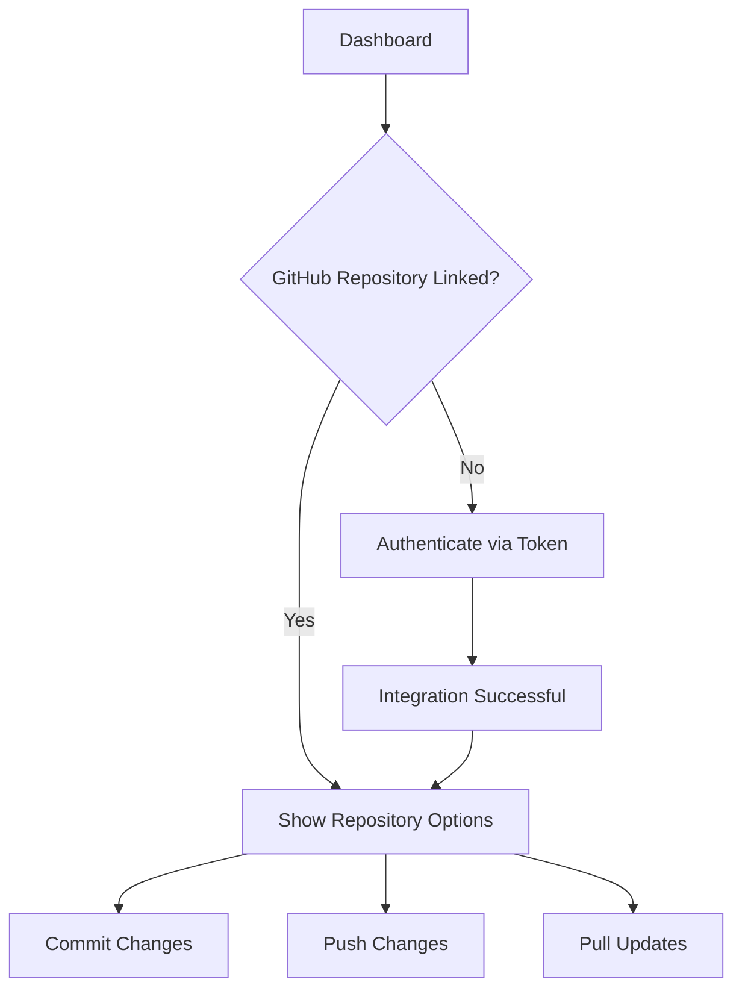

# **Usage Guide**

This guide provides an overview of how to use GameFlow Connect. From the initial setup to leveraging its core features, this document will walk you through the basics of managing game assets efficiently.

## **Overview**
GameFlow Connect is designed to streamline collaboration and asset management for game developers and artists. It integrates with tools like Google Drive and GitHub to provide a unified experience.

---

## **1. Initial Setup**

Here's a flowchart with **Mermaid** explaining how authentitcation process will work.

!!! note Before you begin, ensure that you have completed the installation process. If not, refer to the [Getting Started](getting_started.md) guide.

### **Logging In**

1. **Launch the Application**: Start GameFlow Connect by running the executable file.
2. **Authenticate**: 

    - **Google Drive**: Log in with your Google account to enable file management.
    - **GitHub**: Authenticate using your GitHub token for version control integration.

3. **Dashboard Access**: Upon logging in, you will be directed to the main dashboard.

??? tip "**Why Google Drive?**"
    Our research with artists in Brazil revealed that many prefer using Google Drive due to its simplicity and ease of use.

??? tip "**Why GitHub?**"
    Our current focus is on leveraging a robust platform like GitHub for seamless integration.

---

## **2. Managing Files with Google Drive**

### **Connecting Your Account**

1. Go to the **Google Drive** tab in the sidebar.
2. Click on **Connect Account**.
3. Authenticate using your Google credentials.
4. Once connected, your Google Drive files will be displayed.

### **Uploading Files**

1. Navigate to the **File Management Panel**.
2. Select the **Upload** button.
3. Choose a file from your local system.
4. The file will be uploaded to your connected Google Drive account.

### **Downloading Files**

1. Browse your Google Drive files in the application.
2. Select a file and click **Download**.

---

## **3. Using GitHub for Version Control**

Here's a flowchart with **Mermaid** explaining how GitHub integration will work.

### **Connecting a Repository**

1. Go to the **GitHub** tab.
2. Enter your repository URL or select from a list of connected repositories.
3. Authenticate using your GitHub token.

### **Commit and Push Changes**

1. Make changes to your project files locally.
2. Use the **Commit Changes** button to create a commit.
3. Click **Push to Repository** to sync changes.

### **View File Versions**

1. Select a file in the **File List**.
2. Click **View Versions** to see the version history.

---

## **4. Collaborating with Your Team**

### **Real-Time Collaboration**

1. Enable **Real-Time Sync** in the settings.
2. Changes made by your team will automatically sync.

### **Notifications**

1. Notifications about changes, uploads, and commits will appear in the dashboard.

---

## **5. Asset Visualization**

### **Viewing Files**

1. Use the **Preview Panel** to view supported file types directly in the app.
   - **Images**: PNG, JPG, etc.
   - **3D Models**: Integration planned for future versions.

### **Organizing Assets**

1. Use the **File Tags** feature to categorize your assets.
2. Apply filters to find assets quickly.

---

!!! tip "**Efficient Usage**"
    - **Shortcuts**: Explore keyboard shortcuts in the settings for faster navigation.
    - **Help Section**: Access troubleshooting steps directly from the app if you encounter issues.
    - **Feedback**: Share feedback via the app to help improve future versions.

For any questions not covered here, refer to the [FAQ](faq.md) or contact support.
