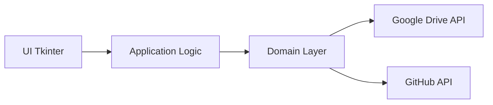
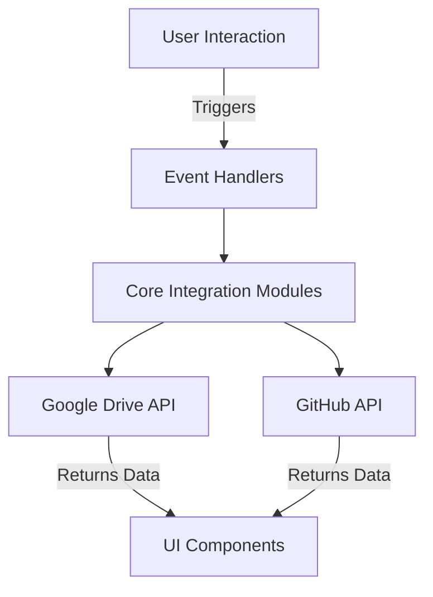

# **Architecture**

GameFlow Connect is built with a modular and scalable architecture, designed to simplify development while ensuring a user-friendly experience. This document outlines the foundational principles and structure of the application.

---

## **1. Atomic Design Framework**

The UI of GameFlow Connect follows the **Atomic Design methodology** to promote reusability and consistency:

- **Atoms**: Basic elements like buttons, text fields, and icons.
- **Molecules**: Combinations of atoms, such as labeled input fields.
- **Organisms**: Complex components like file upload forms.
- **Templates**: Page-level structures combining organisms.
- **Pages**: Specific implementations of templates populated with real data.

By adhering to Atomic Design, the UI components remain modular and easily extendable, enabling rapid iteration and clear design logic.

??? tip "What is Atomic Design?"
    Atomic Design organizes UI components into five hierarchical levels: Atoms, Molecules, Organisms, Templates, and Pages. Each level builds on the previous one, promoting consistency and scalability in design.

---

## **2. Application Layers**

The architecture is divided into four layers:

1. **Interface (View)**: Handles user interactions and displays results using **Tkinter**.
2. **Application (Logic)**: Contains business rules and orchestrates user actions.
3. **Domain**: Represents the core logic of the system, focusing on entities like assets, tasks, and integrations.
4. **Infrastructure**: Manages external services (e.g., APIs for Google Drive and GitHub).

---

## **3. SOLID Principles for Integration**

GameFlow Connect's backend integrates with services like Google Drive and GitHub. These integrations follow **SOLID principles**. Here are some examples on how **Infra logic** should be integrated:

- **Authentication Services**: Handles user login/logout securely using OAuth2 for both Google Drive and GitHub. Tokens are stored securely and refreshed automatically.
- **Google Drive**: Provides APIs for uploading, downloading, and organizing files. A dedicated module ensures smooth interaction and error handling.
- **GitHub**: Integrates version control functionalities, enabling commits, branch management, and repository synchronization directly from the application.

??? tip "What are SOLID Principles?"
    - **Single Responsibility Principle**: Each class has one responsibility.
    - **Open/Closed Principle**: Classes are open for extension but closed for modification.
    - **Liskov Substitution Principle**: Subtypes must be substitutable for their base types.
    - **Interface Segregation Principle**: Interfaces should be specific to client needs.
    - **Dependency Inversion Principle**: High-level modules shouldn't depend on low-level ones; both should depend on abstractions.

---

## **4. Data Flow**

Data flows in a structured pipeline:

1. **User Interaction**: Input is captured through the interface.
2. **Application Logic**: The input is processed by the application layer.
3. **Domain Layer**: Core logic validates and executes the operation.
4. **Integration Services**: Communicates with external APIs for storage or version control.

This design ensures separation of concerns, making the system maintainable and scalable.

---

## **5. Technical Decisions**

### **Why Atomic Design?**
Atomic Design allows for:

- Consistent and reusable UI components.
- Faster development with modular building blocks.
- Improved maintainability by isolating changes to specific levels.

### **Why SOLID Principles?**
Applying SOLID ensures:

- Scalable and testable integration layers.
- Clear separation between core logic and external dependencies.
- Flexibility to introduce new features with minimal disruption.

!!! note "**Developer Notes**"
    For developers diving into the codebase, the architecture ensures flexibility and clarity. Whether extending the UI or adding new integrations, the structure supports rapid iteration. Feel free to explore, and don't hesitate to share feedback or suggest improvements!

---

## **6. Architecture Diagram**

Below is a **Mermaid** diagram illustrating the architecture:

### Application Layers

### Data Flow

This diagram highlights the flow of data and the separation between layers and external services.
